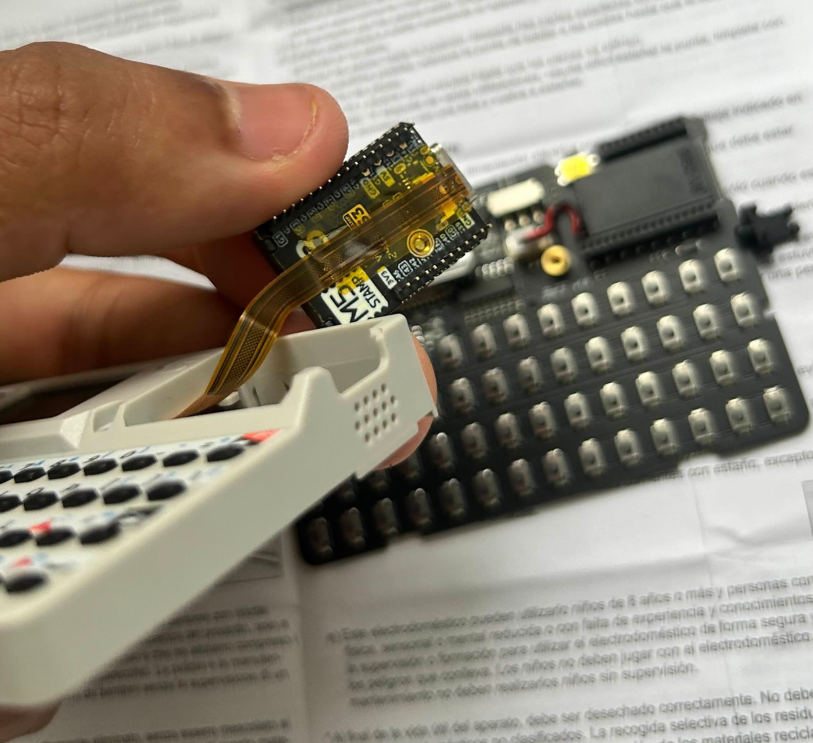
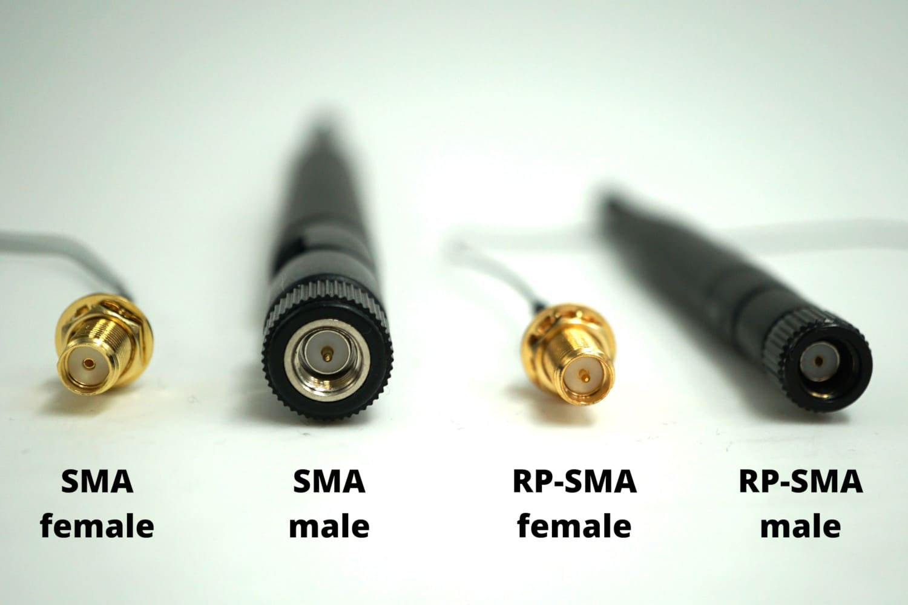
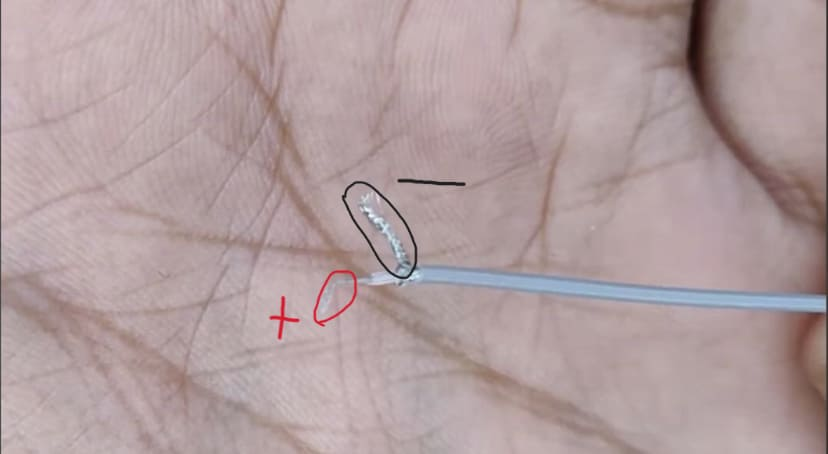
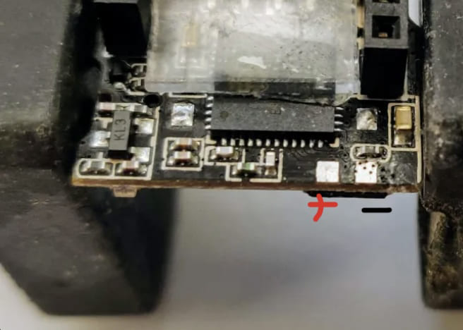
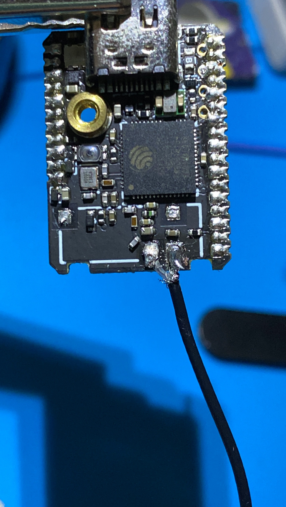
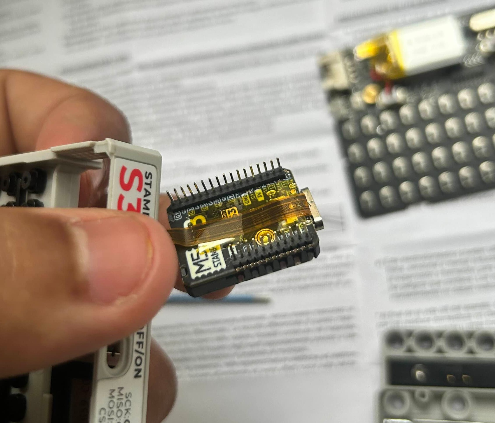
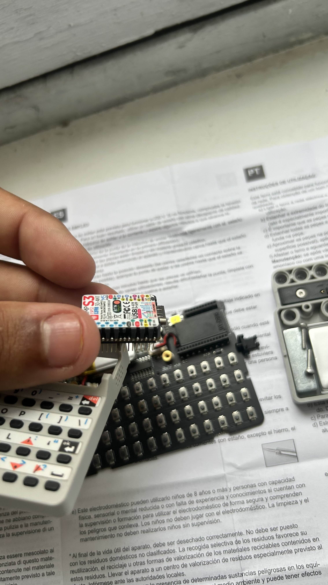
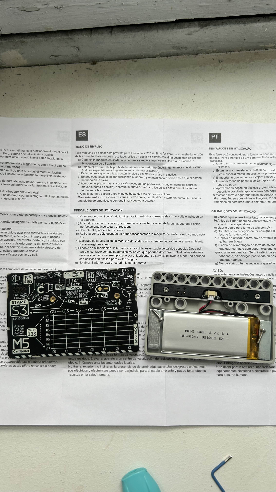
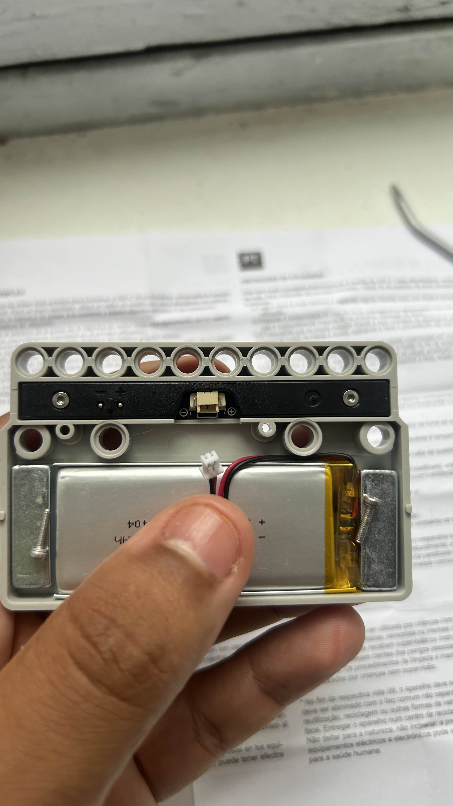
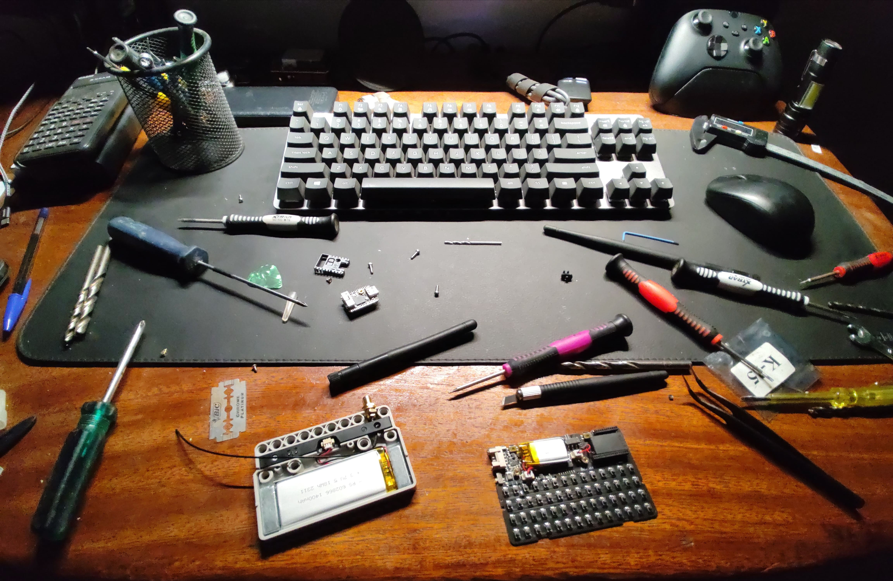

# Antena externa no Cardputer

<h3>👉 Click here for English version</h3>

The idea here is to document the process of installing an external antenna on the Cardputer to improve the Wi-Fi signal strength, gathering as much information as possible to make life easier for anyone who wants to do the same. If you have already done this and have any tips, please submit a pull request with your information.

If you have any questions, open an issue so we can help you.

## 📜 Notes

Keep in mind that you will need to open the Cardputer to install the external antenna. It is somewhat delicate internally, especially the components related to its screen, so care is necessary to avoid damaging your device.

The images showing the polarities of the IPX connector braids in this guide come from the Azur Firmware server on Discord, and credit is due to users `@Cyber.odare` and `@keebasg`. Thank you for sharing your experiences.

I would like to thank the following person for sharing images and information that helped compose this guide:

- [@Lucas-Simoes-Lisboa](https://github.com/Lucas-Simoes-Lisboa)

## 📊 Signal level tests obtained

In order to try to measure the improvement of the Wi-Fi signal with the external antenna, signal level tests were performed with the Cardputer in two different scenarios and with 5 different antenna configurations.

When analyzing the Cardputer's performance for Wi-Fi signal reception, we must keep in mind that the context of the tests is very important, since the Wi-Fi signal is influenced by several factors, such as the distance from the router, the presence of obstacles, interference from other devices, among others. Knowing this, I will try to describe below in as much detail as possible the scenarios and antenna configurations used.

The test scenarios were:

- **Scenario 1**: Tests performed in an urban environment from a modest bakery.
- **Scenario 2**: Tests performed in a rural area from the balcony of a house and open area.

Antenna configurations used:

- **No antenna**: Only the SMA connector, no antenna.

- **Antenna 1**: [Antenna 2.4/5.8GHz 3dBi](https://s.click.aliexpress.com/e/_oEylIq5).
- **Antenna 2**: [2.4GHz 3dBi Antenna](https://pt.aliexpress.com/item/32957527411.html).
- **Antenna 3**: [LTE Antenna 10dBi 700-2700MHz](https://s.click.aliexpress.com/e/_oncECQd).
- **Antenna 4**: [Antenna 2.4GHz 6dBi](https://s.click.aliexpress.com/e/_opXW0nJ).

Regarding the antenna specifications, I follow the information provided by the sellers, since I do not have any tool to measure the real power of the antennas.

For each antenna, 3 tests were performed, and the average of the received signal values ​​was calculated. I also omitted the names of the Wi-Fi networks to maintain the privacy of the establishments. Instead of the network names, I used "Network 1", "Network 2"...

The signals marked with `-` indicate that the signal was not detected.

Below are the test results:

### Scenario 1

| Network | Distance (m) | Channel | No antenna | Antenna 1 | Antenna 2 | Antenna 3 | Antenna 4 |
|------|---------------|-------|------------|----|----------|----------|----------|
| Network 1 | 4 | 1 | -67 | -51 | -45 | -46 | -45 |
| Network 2 | 5 | 4 | -73 | -66 | -59 | -66 | -60 |
| Network 3 | 9 | 2 | -88 | -67 | -63 | -68 | -68 |
| Network 4 | 34 | 6 | -95 | -77 | -72 | -85 | -70 |
| Network 5 | 35 | 1 | -96 | -90 | -87 | -85 | -85 |
| Network 6 | 41 | 11 | -92 | -84 | -80 | -80 | -75 |
| Network 7 | 41 | 1 | -94 | -89 | -86 | -84 | -84 |
| Network 8 | 41 | - | -94 | - | -76 | -79 | -73 |
| Network 9 | 43 | 8 | -94 | -90 | -83 | -84 | -75 |
| Network 10 | 74 | 3 | - | -93 | -82 | -87 | -78 |
| Network 11 | 80 | - | - | - | - | - | -93 |
| Network 12 | 105 | 11 | - | - | -89 | -88 | -87 | -77 |
| Network 13 | 106 | - | - | - | - | - | -92 |
| Network 14 | 117 | - | - | - | - | - | -93 |
| Network 15 | 122 | - | - | - | -89 | -95 | -82 |

### Scenario 2

| Network | Distance (m) | Channel | No antenna | Antenna 1 | Antenna 2 | Antenna 3 | Antenna 4 |
|------|---------------|-------|------------|----------|----------|----------|----------|
| Network 1 | 3 | 11 | -68 | -55 | -50 | -51 | -47 |
| Network 2 | 5 | 1 | -69 | -60 | -57 | -63 | -63 |
| Network 3 | 240 | 6 | - | -87 | -85 | -91 | -87 |
| Network 4 | 246 | 6 | - | -93 | -89 | -89 | -86 |

### Conclusion

Of the four antennas tested, antenna 4 performed best, being able to receive signals from further away, up to 122 meters in urban areas and up to 246 meters in open rural areas. It also achieved better signal levels from closer networks when compared to the other antennas. However, if you prefer a smaller and more compact antenna, antenna 2 also proved to be a good alternative with interesting results, although inferior to antenna 4.

## ⚠️ Precautions to Take When Opening the Cardputer

- Be careful when opening the Cardputer, as the display flat connector is fragile and is connected at the bottom of the STAMP.

Be careful not to bend the STAMP pins.

## 📝 Materials

- SMA Wi-Fi antenna and IPX to SMA adapter (recommended: <https://a.aliexpress.com/_mK5YhoU>)
- Soldering iron
- Solder

You must choose an antenna that has a connector compatible with the IPX to SMA adapter, as there are two types of SMA connectors (SMA and RP-SMA), and you might get confused. See the image below:

## 🛠️ Procedure

Cut the IPX end of the adapter and strip the cable end, separating the outer and inner braids. The outer braid represents the negative cable, while the inner braid represents the positive cable.

Use the soldering iron to heat and remove the solder from the integrated 3D antenna of the Cardputer.

In the photo below, you can see where to solder the positive and negative wires of the external antenna.

After soldering:

Now, adapt the SMA connector to the Cardputer case and connect the antenna. I believe there is not much more to say about this part.

Below are all the other images that can help you better understand the process:

## Out of Context 😅

An experience I, @henriquesebastiao, had:

- During the process of reassembling the Cardputer, I almost gave up; it just wasn’t working!
- And while I was finding space for the SMA plug, I opted to use nothing less than a drill to make a hole in the Cardputer case. Too bad I didn't record it.

A ideia aqui é documentar o processo de instalação de uma antena externa no Cardputer, para melhorar o poder do sinal Wi-Fi, juntando o máximo de informações possíveis para facilitar a vida de quem quiser fazer o mesmo. Se você já fez isso e tem alguma dica, por favor, faça um pull request com suas informações.

Caso você tenha alguma dúvida, abra uma issue para que possamos te ajudar.

## 📜 Notas

Tenha em mente que você precisará abrir o Cardputer para instalar a antena externa, ele é um pouco delicado internamente, principalmente os componentes referentes a sua tela, logo todo o cuidado se faz necessário poara não danificar seu aparelho.

As imagens referentes a polaridades das malhas do conetor IPX presentes nesse passo a passo são oriundas do servidor Azur Firmware no Discord, cujo o crédito é devido aos usuários `@Cyber.odare` e `@keebasg`, agradeço a eles por compartilharem suas experiências.

Agradeço às seguintes pessoa por compartilharem imagens e informações que ajudaram a compor esse passo a passo:

- [@Lucas-Simoes-Lisboa](https://github.com/Lucas-Simoes-Lisboa)

## 📊 Testes de nível de sinais obtidos

A fim de tentar mensurar a melhora do sinal Wi-Fi com a antena externa, foram feitos testes de nível de sinal com o Cardputer em dois cenários diferentes e com 5 configurações de antena diferentes.

Se tratando de analisar a performance do Cardputer para recepção de sinal Wi-Fi, temos que ter em mente que o contexto dos testes importa muito, pois o sinal Wi-Fi é influenciado por diversos fatores, como a distância do roteador, a presença de obstáculos, a interferência de outros dispositivos, entre outros. Sabendo disso tentarei descrever a baixo com máximo de detalhes possível os cenários e as configurações de antena utilizadas.

Os cenários de teste foram:

- **Cenário 1**: Testes realizados em ambiente urbano a partir de modesta padaria.
- **Cenário 2**: Testes realizados em zona rural a partir da varanda de uma casa e área aberta.

Configurações de antena utilizadas:

- **Sem antena**: Apenas o conector SMA, sem antena.
- **Antena 1**: [Antenna 2.4/5.8GHz 3dBi](https://s.click.aliexpress.com/e/_oEylIq5).
- **Antena 2**: [2.4GHz 3dBi Antenna](https://pt.aliexpress.com/item/32957527411.html).
- **Antena 3**: [LTE Antenna 10dBi 700-2700MHz](https://s.click.aliexpress.com/e/_oncECQd).
- **Antena 4**: [Antenna 2.4GHz 6dBi](https://s.click.aliexpress.com/e/_opXW0nJ).

Quanto as especificações das antenas, sigo as informações passadas pelos vendedores, uma vez que não tenho nenhuma ferramenta para medir a real potência das antenas.

Para cada antena foram realizados 3 testes, e a média dos valores de sinal recebido foi calculada, também omiti os nomes das redes Wi-Fi para manter a privacidade dos estabelecimentos, no lugar dos nomes das redes utilizei "Rede 1", "Rede 2"...

Os sinais marcados com `-` indicam que o sinal não foi detectado.

Segue abaixo os resultados dos testes:

### Cenário 1

| Rede | Distância (m) | Canal | Sem antena | Antena 1 | Antena 2 | Antena 3 | Antena 4 |
|------|---------------|-------|------------|----------|----------|----------|----------|
| Rede 1 | 4 | 1 | -67 | -51 | -45 | -46 | -45 |
| Rede 2 | 5 | 4 | -73 | -66 | -59 | -66 | -60 |
| Rede 3 | 9 | 2 | -88 | -67 | -63 | -68 | -68 |
| Rede 4 | 34 | 6 | -95 | -77 | -72 | -85 | -70 |
| Rede 5 | 35 | 1 | -96 | -90 | -87 | -85 | -85 |
| Rede 6 | 41 | 11 | -92 | -84 | -80 | -80 | -75 |
| Rede 7 | 41 | 1 | -94 | -89 | -86 | -84 | -84 |
| Rede 8 | 41 | - | -94 | - | -76 | -79 | -73 |
| Rede 9 | 43 | 8 | -94 | -90 | -83 | -84 | -75 |
| Rede 10 | 74 | 3 | - | -93 | -82 | -87 | -78 |
| Rede 11 | 80 | - | - | - | - | - | -93 |
| Rede 12 | 105 | 11 | - | -89 | -88 | -87 | -77 |
| Rede 13 | 106 | - | - | - | - | - | -92 |
| Rede 14 | 117 | - | - | - | - | - | -93 |
| Rede 15 | 122 | - | - | - | -89 | -95 | -82 |

### Cenário 2

| Rede | Distância (m) | Canal | Sem antena | Antena 1 | Antena 2 | Antena 3 | Antena 4 |
|------|---------------|-------|------------|----------|----------|----------|----------|
| Rede 1 | 3 | 11 | -68 | -55 | -50 | -51 | -47 |
| Rede 2 | 5 | 1 | -69 | -60 | -57 | -63 | -63 |
| Rede 3 | 240 | 6 | - | -87 | -85 | -91 | -87 |
| Rede 4 | 246 | 6 | - | -93 | -89 | -89 | -86 |

### Conclusão

Das quatro antenas testadas, a antena 4 foi a que se saiu melhor, conseguindo receber sinais mais distantes até 122 metros em área urbana e até 246 em área rural aberta. E conseguindo níveis de sinais melhores da redes mais próximas se comparados com as outras antenas. Contudo, caso você prefira uma antenar menor e mais compacta a antena 2 também se mostrar uma boa alternativa com resultados interessantes, porém inferiores a antena 4.

## ⚠️ Cuidados a serem tomados ao abrir o Cardputer

- Tome cuidado ao abrir o Cardputer, pois o conector flat do display é frági e é conectado na parte de baixo do STAMP.

- Cuidado para não entortar os pinos do STAMP.

## 📝 Materiais

- Antena Wi-Fi SMA e adaptador IPX para SMA (recomendado: <https://a.aliexpress.com/_mK5YhoU>)
- Ferro de solda
- Estanho

Você deve escolher uma antena que tenha o conector compatível com o adaptador IPX para SMA, pois existem dois tipos de conectores SMA (SMA e RP-SMA), e você pode acabar se confundindo, veja a imagem abaixo:

## 🛠️ Procedimento

Corte a ponta IPX do adaptador e descasque a ponta do cabo, separe a malha externa da interna, a malha externa representa o cabo negativo, já a interna representa o cabo positivo.

Com o ferro de solda esquente a solda da antena 3D integrada do Cardputer e a remova.

Na foto abaixo você pode ver onde deve soldar os fios positivo e negativo da antena externa.

Após soldar:

Agora basta adaptar o conector SMA na carcassa do Cardputer e conectar a antena. Creio que não há muito a ser dito sobre essa parte.

Segue abaixo todas as demais imagens que podem lhe ajudar a entender melhor o processo:

## Fora de contexto 😅

Experiencia que eu, [@henriquesebastiao](https://github.com/henriquesebastiao) tive:

- Durante o processo de montar o Cardputer de volta eu quase desisti, o trem que não dava certo!
- E enquanto eu acho um espaço para caber o plug SMA eu optei por usar nada mais nada menos que uma furadeira para fazer um buraco na carcaça do Cardputer, pena que nao registrei isso.

